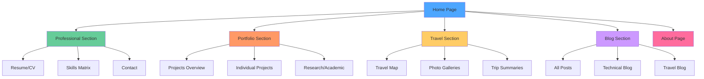
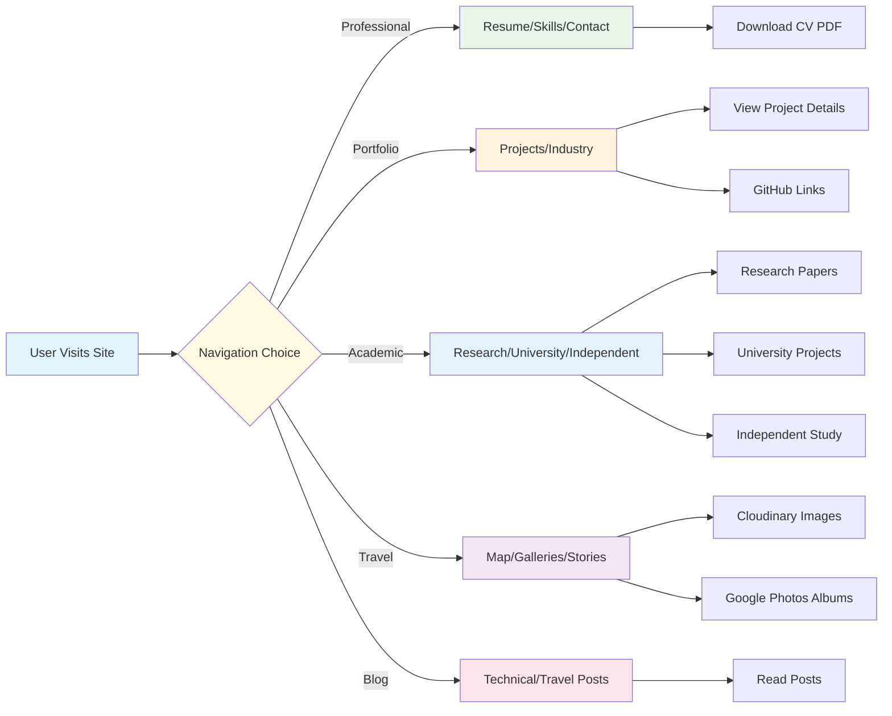
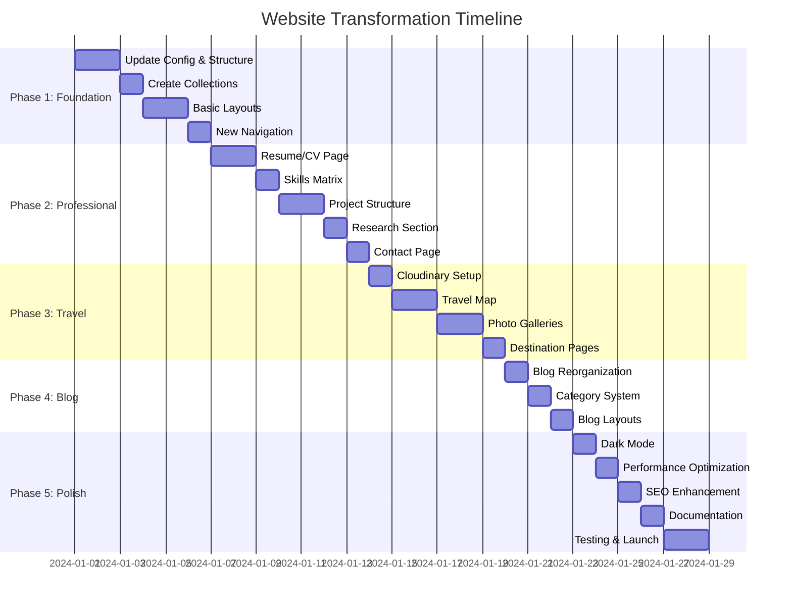
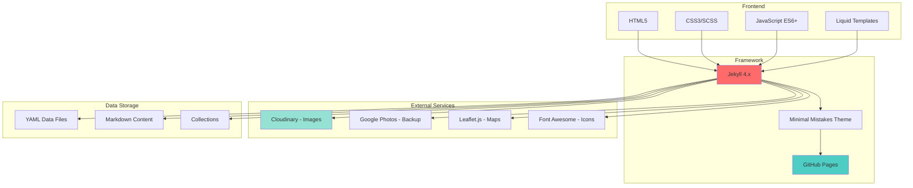
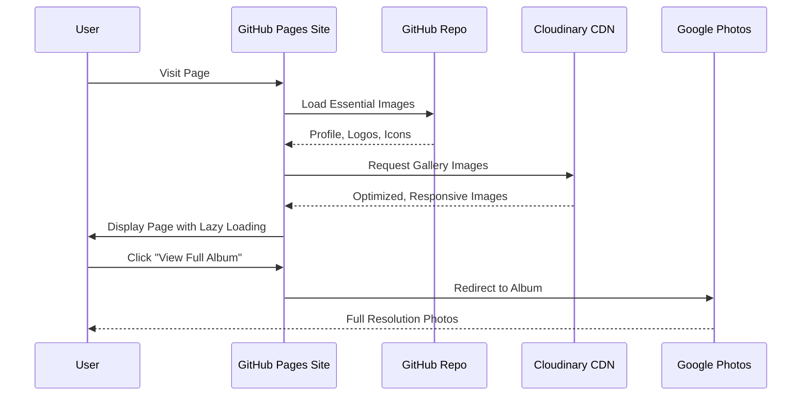

# Implementation Roadmap - Ultimate Personal Brand Hub

## Visual Site Structure



## Content Flow Architecture



## Implementation Phases Timeline



## Technology Stack



## Data Flow for Images



## Phase 1: Foundation - Detailed Steps

### Step 1.1: Update Configuration
- [ ] Enhance `_config.yml` with new collections
- [ ] Add SEO metadata
- [ ] Configure plugins
- [ ] Set up defaults for new content types

### Step 1.2: Create Directory Structure
```
Create:
├── _pages/professional/
├── _pages/portfolio/
├── _pages/travel/
├── _pages/blog/
├── _projects/
├── _research/
├── _travel_destinations/
├── _includes/custom/
├── _layouts/custom/
├── _sass/custom/
└── assets/js/custom/
```

### Step 1.3: Set Up Collections
```yaml
collections:
  projects:
    output: true
    permalink: /portfolio/:name/
  research:
    output: true
    permalink: /portfolio/research/:name/
  travel_destinations:
    output: true
    permalink: /travel/destinations/:name/
```

### Step 1.4: Create Base Layouts
- [ ] `_layouts/home.html` - Enhanced homepage
- [ ] `_layouts/resume.html` - CV layout
- [ ] `_layouts/project.html` - Project showcase
- [ ] `_layouts/travel-destination.html` - Travel page

### Step 1.5: Update Navigation
```yaml
main:
  - title: "Professional"
    sublinks:
      - title: "Resume"
      - title: "Skills"
      - title: "Contact"
  # ... etc
```

## Phase 2: Professional Content - Detailed Steps

### Step 2.1: Resume/CV Page
**Components:**
- Timeline visualization
- Work experience cards
- Education section
- PDF download button
- Skills summary

**Data Structure:**
```yaml
# _data/timeline.yml
work:
  - title: "IT Lead"
    company: "Partners in Planning"
    period: "2023-2024"
    achievements:
      - Achievement 1
      - Achievement 2
education:
  - degree: "Master of Science"
    institution: "University of Melbourne"
    period: "2022-2024"
```

### Step 2.2: Skills Matrix
**Categories:**
- Programming Languages
- Frameworks & Libraries
- Tools & Technologies
- Soft Skills
- Certifications

**Visual Representation:**
- Proficiency bars
- Skill badges
- Category grouping
- Interactive tooltips

### Step 2.3: Projects Portfolio
**Project Card Components:**
- Featured image
- Title and brief description
- Technology tags
- GitHub link
- Demo link (if applicable)
- "Read More" button

**Individual Project Page:**
- Hero image
- Full description
- Problem statement
- Solution approach
- Technologies used
- Challenges and learnings
- Results and impact
- Screenshots/demos
- Code snippets
- GitHub repository link

### Step 2.4: Research Section
**Content:**
- Research papers
- Academic projects
- Thesis work
- Publications
- Conference presentations

## Phase 3: Travel Content - Detailed Steps

### Step 3.1: Cloudinary Setup
**Configuration:**
```javascript
// assets/js/cloudinary-config.js
const cloudinaryConfig = {
  cloudName: 'your-cloud-name',
  apiKey: 'your-api-key'
};

// Responsive image function
function getCloudinaryUrl(imageId, width) {
  return `https://res.cloudinary.com/${cloudinaryConfig.cloudName}/image/upload/c_scale,w_${width},dpr_auto,f_auto,q_auto/${imageId}`;
}
```

**Features:**
- Automatic format selection (WebP, AVIF)
- Responsive sizing
- Lazy loading
- Progressive loading
- Quality optimization

### Step 3.2: Interactive Travel Map
**Implementation with Leaflet.js:**
```javascript
// assets/js/travel-map.js
const map = L.map('travel-map').setView([0, 0], 2);

// Add markers for visited locations
locations.forEach(location => {
  L.marker([location.lat, location.lng])
    .bindPopup(location.name)
    .addTo(map);
});
```

**Features:**
- Markers for visited locations
- Popup with location info
- Links to destination pages
- Custom marker icons
- Clustering for dense areas

### Step 3.3: Photo Galleries
**Gallery Structure:**
```yaml
# _travel_destinations/sumatra.md
---
title: "Sumatra, Indonesia"
cloudinary_folder: "sumatra-2024"
google_photos_album: "album-url"
featured_photos:
  - image_id: "photo1"
    caption: "Description"
  - image_id: "photo2"
    caption: "Description"
---
```

**Gallery Features:**
- Grid layout
- Lightbox for full-size viewing
- Lazy loading
- Captions
- Link to Google Photos for full album

## Phase 4: Blog System - Detailed Steps

### Step 4.1: Blog Reorganization
**Current Structure:**
```
_posts/
├── 2024-07-12-First-post.md
├── 2024-07-19-Week-one.md
└── ...
```

**New Structure:**
```
_posts/
├── technical/
│   ├── 2024-01-15-python-tutorial.md
│   └── 2024-02-20-math-concepts.md
└── travel/
    ├── 2024-07-12-First-post.md
    ├── 2024-07-19-Week-one.md
    └── ...
```

### Step 4.2: Category System
**Front Matter:**
```yaml
---
layout: single
title: "Post Title"
categories: [travel, technical]
tags: [python, tutorial, mathematics]
---
```

**Category Pages:**
- `/blog/` - All posts
- `/blog/technical/` - Technical posts only
- `/blog/travel/` - Travel posts only

### Step 4.3: Enhanced Blog Layouts
**Features:**
- Reading time estimate
- Category badges
- Tag cloud
- Related posts
- Social sharing buttons
- Author bio
- Comments (optional)

## Phase 5: Enhancement & Polish - Detailed Steps

### Step 5.1: Dark Mode Implementation
**CSS Variables:**
```css
:root {
  --bg-primary: #ffffff;
  --bg-secondary: #f5f5f5;
  --text-primary: #333333;
  --text-secondary: #666666;
  --accent: #0066cc;
  --border: #e0e0e0;
}

[data-theme="dark"] {
  --bg-primary: #1a1a1a;
  --bg-secondary: #2d2d2d;
  --text-primary: #e0e0e0;
  --text-secondary: #b0b0b0;
  --accent: #4da6ff;
  --border: #404040;
}
```

**Toggle Button:**
```javascript
// assets/js/dark-mode.js
const toggle = document.getElementById('dark-mode-toggle');
toggle.addEventListener('click', () => {
  const currentTheme = document.documentElement.getAttribute('data-theme');
  const newTheme = currentTheme === 'dark' ? 'light' : 'dark';
  document.documentElement.setAttribute('data-theme', newTheme);
  localStorage.setItem('theme', newTheme);
});
```

### Step 5.2: Performance Optimization
**Techniques:**
- Image lazy loading
- CSS/JS minification
- Font optimization
- Reduce HTTP requests
- Enable compression
- Optimize critical rendering path

**Lazy Loading:**
```javascript
// assets/js/lazy-load.js
const images = document.querySelectorAll('img[loading="lazy"]');
const imageObserver = new IntersectionObserver((entries) => {
  entries.forEach(entry => {
    if (entry.isIntersecting) {
      const img = entry.target;
      img.src = img.dataset.src;
      imageObserver.unobserve(img);
    }
  });
});

images.forEach(img => imageObserver.observe(img));
```

### Step 5.3: SEO Enhancement
**Meta Tags:**
```html
<!-- _includes/head/custom.html -->
<meta name="description" content="{{ page.description | default: site.description }}">
<meta name="keywords" content="{{ page.keywords | join: ', ' }}">

<!-- Open Graph -->
<meta property="og:title" content="{{ page.title | default: site.title }}">
<meta property="og:description" content="{{ page.description | default: site.description }}">
<meta property="og:image" content="{{ page.image | default: site.og_image | absolute_url }}">
<meta property="og:url" content="{{ page.url | absolute_url }}">

<!-- Twitter Card -->
<meta name="twitter:card" content="summary_large_image">
<meta name="twitter:title" content="{{ page.title | default: site.title }}">
<meta name="twitter:description" content="{{ page.description | default: site.description }}">
<meta name="twitter:image" content="{{ page.image | default: site.og_image | absolute_url }}">
```

**Structured Data:**
```html
<script type="application/ld+json">
{
  "@context": "https://schema.org",
  "@type": "Person",
  "name": "Oscar Rochanakij",
  "url": "https://orochac.github.io",
  "sameAs": [
    "https://github.com/orochac",
    "https://instagram.com/oscarrchkij"
  ],
  "jobTitle": "IT Lead",
  "alumniOf": "University of Melbourne"
}
</script>
```

## Content Templates

### Project Template Example
```markdown
---
layout: project
title: "E-Commerce Platform"
date: 2024-01-15
categories: [web-development, full-stack]
technologies: [Python, Django, PostgreSQL, React, Docker]
github: https://github.com/username/ecommerce
demo: https://demo.example.com
featured: true
image: /assets/images/projects/ecommerce.jpg
excerpt: "A full-featured e-commerce platform with payment integration and inventory management"
---

## Overview
Brief description of the project and its purpose.

## Problem Statement
What problem does this project solve? Who is it for?

## Solution
How did you approach solving this problem?

## Key Features
- Feature 1
- Feature 2
- Feature 3

## Technologies Used
- **Backend**: Python, Django, PostgreSQL
- **Frontend**: React, Redux, Material-UI
- **DevOps**: Docker, GitHub Actions
- **Payment**: Stripe API

## Challenges & Solutions
### Challenge 1: Scalability
**Problem**: Initial architecture couldn't handle high traffic
**Solution**: Implemented caching with Redis and optimized database queries

### Challenge 2: Payment Security
**Problem**: Ensuring PCI compliance
**Solution**: Used Stripe's hosted checkout for secure payment processing

## Results
- Processed 10,000+ transactions
- 99.9% uptime
- Average page load time: 1.2 seconds
- Positive user feedback

## Screenshots


## Code Highlights
```python
# Example of key functionality
def process_order(order_id):
    # Implementation
    pass
```

## Learnings
What did you learn from this project?

## Future Improvements
- Planned feature 1
- Planned feature 2

[View on GitHub](https://github.com/username/ecommerce) | [Live Demo](https://demo.example.com)
```

### Travel Destination Template Example
```markdown
---
layout: travel-destination
title: "Sumatra, Indonesia"
date: 2024-07-01
location: "Sumatra, Indonesia"
coordinates: [0.5897, 101.3431]
duration: "8 weeks"
highlights: [Nature, Culture, Adventure, Wildlife]
best_time: "May to September"
budget: "$$"
cloudinary_folder: "sumatra-2024"
google_photos_album: "https://photos.app.goo.gl/..."
featured_image: "sumatra-hero"
gallery_images:
  - id: "sumatra-1"
    caption: "Lake Toba at sunset"
  - id: "sumatra-2"
    caption: "Orangutan in Bukit Lawang"
  - id: "sumatra-3"
    caption: "Traditional Batak house"
---

## Overview
Sumatra, the sixth-largest island in the world, offers incredible biodiversity, rich culture, and stunning landscapes. From the volcanic Lake Toba to the rainforests of Bukit Lawang, this Indonesian island is a paradise for nature lovers and adventure seekers.

## Highlights

### 🏞️ Lake Toba
The world's largest volcanic lake, surrounded by traditional Batak villages and stunning mountain scenery.

### 🦧 Bukit Lawang
Trek through the jungle to see wild orangutans in their natural habitat.

### 🌋 Mount Sinabung
Active volcano with dramatic landscapes and traditional villages.

### 🏖️ Mentawai Islands
World-class surfing and indigenous culture.

## Itinerary

### Week 1-2: Medan & Bukit Lawang
- Arrived in Medan
- 3-day jungle trek in Bukit Lawang
- Saw 15+ orangutans in the wild
- River tubing back to village

### Week 3-4: Lake Toba
- Ferry to Samosir Island
- Explored traditional Batak villages
- Learned about local culture and history
- Relaxed by the lake

### Week 5-6: Berastagi & Mount Sinabung
- Visited fruit markets
- Hiked around Mount Sinabung
- Explored hot springs

### Week 7-8: West Coast
- Surfing in Mentawai Islands
- Beach relaxation
- Local village visits

## Practical Information

### Getting There
- Fly to Kualanamu International Airport (KNO) in Medan
- Domestic flights available to other cities
- Buses connect major destinations

### Accommodation
- **Budget**: Guesthouses $5-15/night
- **Mid-range**: Hotels $20-40/night
- **Luxury**: Resorts $50+/night

### Food
- Local warungs: $1-3 per meal
- Restaurants: $5-10 per meal
- Must-try: Rendang, Soto Padang, Nasi Goreng

### Transportation
- Local buses: Very cheap but slow
- Private drivers: $30-50/day
- Motorbike rental: $5-10/day

### Budget
Total for 8 weeks: ~$1,500
- Accommodation: $400
- Food: $400
- Transportation: $300
- Activities: $200
- Miscellaneous: $200

## Tips & Recommendations

### Do's
- ✅ Learn basic Indonesian phrases
- ✅ Bring rain gear (tropical climate)
- ✅ Respect local customs and dress modestly
- ✅ Try local food from warungs
- ✅ Bargain at markets (politely)

### Don'ts
- ❌ Drink tap water
- ❌ Touch people's heads (cultural taboo)
- ❌ Show public affection
- ❌ Point with your index finger

### What to Pack
- Lightweight, breathable clothing
- Rain jacket
- Good hiking shoes
- Insect repellent
- Sunscreen
- First aid kit
- Water purification tablets

## Photo Gallery

[Gallery will be automatically generated from Cloudinary folder]

[View Full Album on Google Photos](https://photos.app.goo.gl/...)

## Related Posts
- [Week One in Sumatra](/blog/travel/Week-one/)
- [Week Two in Sumatra](/blog/travel/Week-two/)
- [Orangutans of Bukit Lawang](/blog/travel/orangutans/)

## Map
[Interactive map will be embedded here showing route and key locations]
```

## Documentation to Create

### 1. CONTENT_GUIDE.md
Instructions for adding new content:
- How to add a new project
- How to add a blog post
- How to add travel destinations
- How to update resume
- How to add photos to Cloudinary

### 2. CLOUDINARY_SETUP.md
Step-by-step guide:
- Creating Cloudinary account
- Uploading images
- Organizing folders
- Getting image URLs
- Integration code

### 3. MAINTENANCE.md
Ongoing maintenance tasks:
- Regular updates
- Backup procedures
- Performance monitoring
- SEO checks
- Content review schedule

## Success Criteria

### Professional Goals ✅
- [ ] Clear, professional resume presentation
- [ ] Comprehensive skills showcase
- [ ] Detailed project portfolio
- [ ] Easy CV download
- [ ] Professional contact options

### Personal Goals ✅
- [ ] Engaging travel content
- [ ] Beautiful photo galleries
- [ ] Interactive travel map
- [ ] Personal story and interests
- [ ] Balanced professional/personal content

### Technical Goals ✅
- [ ] Page load time < 3 seconds
- [ ] Mobile responsive (all devices)
- [ ] Accessibility (WCAG AA)
- [ ] SEO optimized
- [ ] Dark mode functional
- [ ] Images optimized and lazy-loaded

### User Experience Goals ✅
- [ ] Intuitive navigation
- [ ] Clear content hierarchy
- [ ] Easy to find information
- [ ] Engaging visual design
- [ ] Fast and smooth interactions

## Launch Checklist

### Pre-Launch
- [ ] All pages created and tested
- [ ] Content proofread
- [ ] Images optimized
- [ ] Links verified
- [ ] Mobile testing complete
- [ ] Browser compatibility checked
- [ ] SEO metadata complete
- [ ] Analytics configured
- [ ] Performance optimized

### Launch
- [ ] Push to GitHub
- [ ] Verify GitHub Pages deployment
- [ ] Test live site
- [ ] Submit to search engines
- [ ] Share on social media

### Post-Launch
- [ ] Monitor analytics
- [ ] Gather feedback
- [ ] Make iterative improvements
- [ ] Regular content updates
- [ ] Performance monitoring

---

**Ready to begin implementation?** Let's start with Phase 1: Foundation!